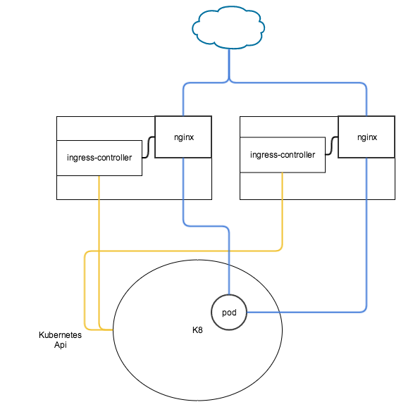

# External Nginx Ingress Controller

The external nginx ingress controller is a fork of the orginal nginx ingress controller with the goal to be usable outside of kubernetes.
Instead of running in a pod, this will run as a system service along side nginx.

The goal of the external ingress controller is to be usable where nginx cannot be run in a container, such as when nginx is fronting customers on Internet in such a way that container restarts are not a option.

Example when you host your kubernetes cluster on-premise and don't want to have multiple layers of "load balancing" in front of your pods. You also really like nginx. 
Using this ingress controller on your edge load balacing cluster, the configuration is kept up too date and you can still use nginx build-in functions for zero down time deployments of config and binaries that the normal "in-cluster" ingress controller don't support.

## Design

### Overview

The following shows how nginx and the ingress controller sits outside the cluster to serve traffic. The ingress controller updates nginx configuration file with the ip addresses to the cluster pods directly. Simple and understandable.

#### Requirements
- Nginx should be installed and managed already. :)

- The nginx nodes that live outside the cluster needs to be able to have network connectivity to both the api servers of kubernetes and the pods themselves.

Note: 

Clustering and making nginx highly availble is outside the scope of this project. 
This could be done many ways. We at [Unibet](https://www.unibet.com)  use ECMP in our routers to load balance traffic at the edge over all our instances in a stateless manner, while also making sure the nodes always are in HA pairs for failover. This is just one setup of a edge cluster and there is many different ways you could accomplish the same.

Networking is outside the scope of this project, briefly we use bgp with [Project Calico](https://www.projectcalico.org/) to enable the pods to have visible ip addresses outside the cluster on our network that can be accessed like normal.

## Installation

TODO: Write here nice instructions, basically
- git clone
- make build
- copy rootfs ( binary and config ) from rootfs/nginx-ingress-controller to your server
- make sure you have k8s config file
- create a init file to launch as a service
- run with correct arguments

example:
`export POD_NAME=default`
`export POD_NAMESPACE=default`
`./nginx-ingress-controller --default-backend-service=default/$K8_DEFAULTBACKEND --apiserver-host=https://$K8_API --kubeconfig ~/.kube/config`

- profit

## Usage 

It works very much like the original ingress controller, and supports mostly the same features. For full understanding, please read: https://github.com/kubernetes/ingress/tree/master/controllers/nginx 

